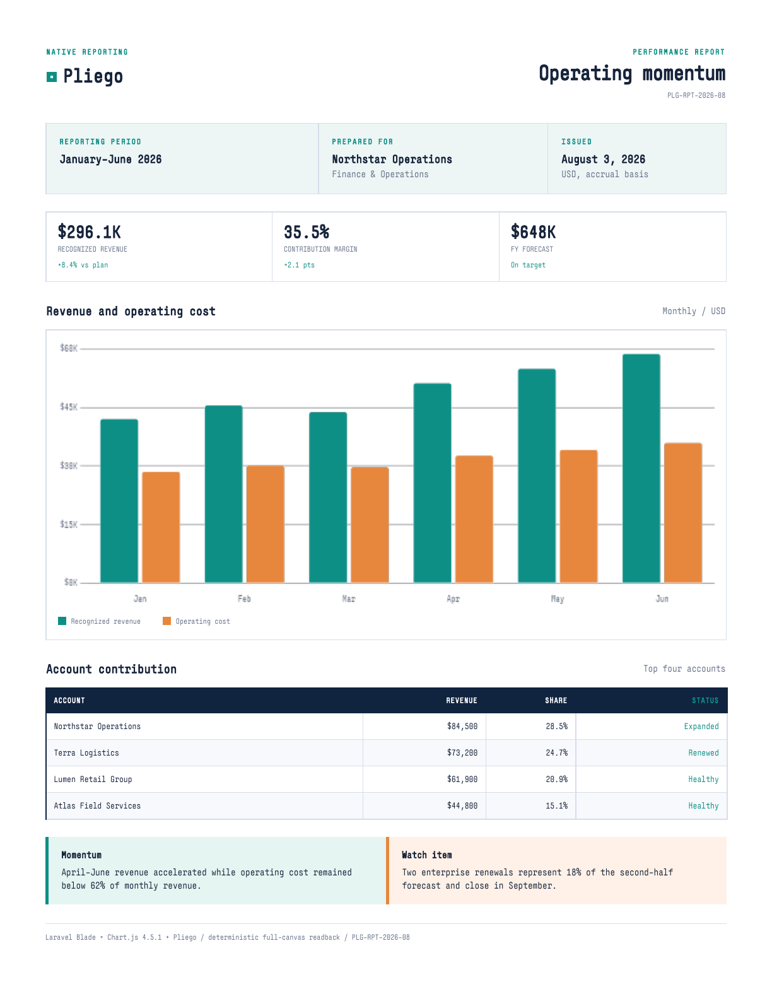

# Pliego

Pliego is an open-source native HTML-to-PDF engine built on Servo for
application-owned invoices, statements, and operational reports. It turns HTML and
CSS into paginated PDFs without Chromium, Node.js, or Java in the runtime.

Pliego focuses on predictable document workflows:

- authored page breaks, paged tables, repeated headers, and row constraints;
- selectable text, links, and embedded TTF, OTF, WOFF, and WOFF2 fonts;
- network-denied rendering by default, with explicit URL allowlists for remote
  stylesheets, images, and fonts;
- typed failures and retained input, resource, scene, PDF, and diagnostic artifacts;
  and
- native bundles for Linux x86_64, Windows x86_64, macOS x86_64, and macOS arm64.

## Rendered output

These are exact PDF responses from a Laravel application running Pliego v0.1.1.
The operating report draws Chart.js 4.5.1, signals readiness after the final
canvas readback, and then renders to PDF. The invoice exercises embedded fonts,
an authored page break, a dense 20-row ledger, and calculated totals.

[](docs/pliego/showcase/chartjs-report.pdf)

- [Chart.js operating report (PDF, one page)](docs/pliego/showcase/chartjs-report.pdf)
- [Styled invoice (PDF, two pages)](docs/pliego/showcase/invoice.pdf)

## Laravel quick start

```sh
composer require oxhq/pliego-laravel:^0.1.0
php artisan pliego:install
php artisan pliego:doctor
```

The default render path is:

```php
use Pliego\Laravel\Facades\Document;

return Document::view('invoice', compact('rows'))->download();
```

The defaults cover the common local document path. Add policy and document options
only when the view needs them:

```php
use Pliego\Laravel\Facades\Document;

return Document::view('invoices.show', ['invoice' => $invoice])
    ->locale('es-MX')
    ->timezone('PST8PDT')
    ->denyNetwork()
    ->asset('fonts/invoice.woff2', resource_path('fonts/invoice.woff2'))
    ->download('invoice.pdf');
```

Static Blade views need no readiness calls. Pliego infers readiness after page load
and waits for `document.fonts.ready`. Call `defer()` only when JavaScript will keep
changing the document or a canvas after load, then finish with `ready()` or `fail()`:

```html
<script>
window.pliego?.defer();
loadReportData()
    .then(drawReport)
    .then(() => window.pliego?.ready())
    .catch(error => window.pliego?.fail(error.message));
</script>
```

Chart.js 4.5.1 is covered for a deterministic, non-animated chart that performs a
synchronous full-canvas `getImageData(0, 0, canvas.width, canvas.height)` readback
after its final draw. Pliego retains those pixels as the authoritative canvas
result; this does not imply compatibility with every Chart.js mode or Canvas API.

The current PDF paint boundary retains resolved sRGB text colors, solid
backgrounds, uniform-color sharp axis-aligned solid borders, and uniform solid
collapsed-table borders. CSS gradients and background-image layers, box and text
shadows, text decorations, rounded or mixed-color borders, clips, non-solid and
image borders, transforms, opacity, filters, and blend modes are explicitly
unsupported and reported instead of approximated. Default rendering fails without
publishing a partial PDF; `--allow-partial-scene` is only for retained diagnostics.
See the [support profile](docs/pliego/support-profile.md) for the complete boundary.

`download()` returns a Laravel file response. Use `render()` instead to receive a
result with the PDF, input-bundle, and retained-artifact paths.

Ubuntu 22.04 x86_64 needs `ca-certificates`, `libfontconfig1`, `libegl1`, and
`libgl1-mesa-dri`. Headless containers also need a writable mode-0700
`XDG_RUNTIME_DIR`; no display server or Xvfb is required.
Windows x64 requires the latest
[Microsoft Visual C++ v14 Redistributable](https://learn.microsoft.com/en-us/cpp/windows/latest-supported-vc-redist?view=msvc-170).
macOS Intel and Apple Silicon bundles require macOS 13 or newer. The Intel
binary is unsigned and Apple Silicon is ad-hoc signed; neither is Developer ID
signed or notarized.

`pliego:install` downloads the package-pinned runtime for the current platform and
verifies its size and SHA-256 before installation. `pliego:doctor` checks the engine
API, writable storage, bundled font, and an offline PDF render.

Network access remains opt-in. A Google Fonts stylesheet needs explicit roots for
both `https://fonts.googleapis.com/` and `https://fonts.gstatic.com/s/`.

See the [Laravel package guide](sdk/laravel/README.md) for Blade rendering, local
assets, controlled URLs, typed failures, and artifact retention.

## Native CLI

Download a bundle from [Releases](https://github.com/oxhq/pliego/releases), verify
its adjacent SHA-256 file, and run:

```sh
pliego render document.html --output document.pdf --artifacts artifacts
```

Host-font fallback, network access, redirects, and asset caching are disabled by
default. Partial scene capture also fails before the requested output is published.
The [support profile](docs/pliego/support-profile.md) defines the current
capability, resource, and failure boundaries.

## Release evidence

Native bundles are built and API-smoked on all four targets in the
[package matrix](https://github.com/oxhq/pliego/actions/workflows/pliego-package.yml). The
[PHP package](https://packagist.org/packages/oxhq/pliego-php) and
[Laravel package](https://packagist.org/packages/oxhq/pliego-laravel) are available
on Packagist and pass focused hosted package checks.

These checks prove the packaged binaries start with the expected engine API and the
Composer distributions pass their focused contracts. The support profile remains
the boundary; Pliego does not claim browser-wide compatibility or safe rendering of
untrusted HTML.

The current stable release is v0.1.1 and exposes engine API 1. For the project's
scope, evidence, and next gates, see:

- [Project overview](docs/project-overview.md)
- [Roadmap](ROADMAP.md)
- [Benchmark methodology](docs/benchmarks/README.md)
- [Security threat model](docs/security/threat-model.md)
- [2026 funding plan](docs/funding/2026.md)

Controlled capture and API2 work described in those planning documents is not part
of the v0.1.1 release.

Every native archive includes the project and specification licenses, an exact tagged
source pointer, the generated Cargo dependency report, and pinned notices for copied
or linked native code. Windows archives additionally inventory their ANGLE DLLs and
the exact mozangle, Chromium, Khronos/Vulkan, Bison, and zlib notices they require.

## Building from source

```sh
./mach bootstrap
cargo build -p pliego --locked --profile checked-release
```

On Windows, run `./mach` as `./mach.bat` or `python mach` from a configured Servo
build environment.

## Servo relationship

Pliego preserves Servo's source layout so upstream security and web-platform fixes
can be reviewed without rewriting the fork. The `upstream-main` branch mirrors
Servo `main`; temporary `sync/servo-YYYY-MM-DD` branches carry reviewed updates into
Pliego. Servo build documentation remains available in the
[Servo Book](https://book.servo.org/).

## License and contributing

The engine is MPL-2.0. The PHP and Laravel packages are MIT-licensed. See
[CONTRIBUTING.md](CONTRIBUTING.md), [SECURITY.md](SECURITY.md), and the
[third-party notices](docs/pliego/third-party-notices.md).
