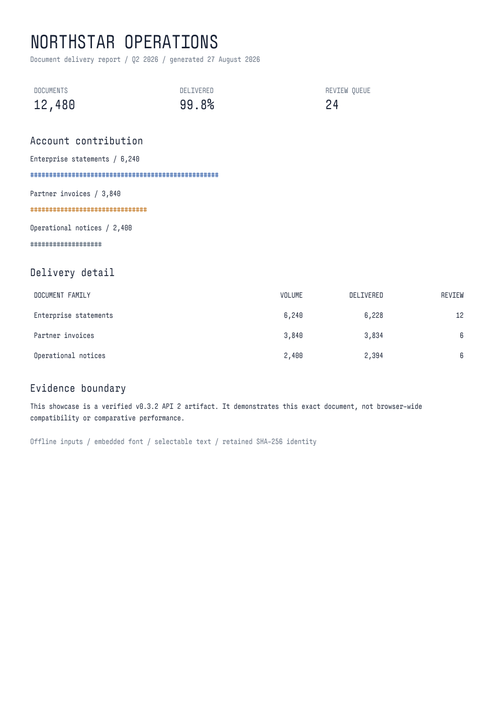

# Pliego

Pliego is an open-source native HTML-to-PDF engine built on Servo for
application-owned invoices, statements, and operational reports. It turns HTML and
CSS into paginated PDFs without Chromium, Node.js, or Java in the runtime.

**Current stable line:** Pliego 0.3 / API 2. **Recommended build:** v0.3.2.

Pliego focuses on document workflows whose inputs and failure boundaries can be made
explicit:

- authored page breaks, paged tables, repeated headers, and row constraints;
- selectable text and embedded TTF, OTF, WOFF, and WOFF2 fonts;
- an offline API 2 input closure containing the exact authorized stylesheets,
  images, scripts, and fonts;
- typed failures and retained input, resource, scene, PDF, and diagnostic artifacts;
  and
- native bundles for Linux x86_64, Windows x86_64, macOS x86_64, and macOS arm64.

## Rendered output

These are exact outputs from the published Pliego v0.3.2 Linux bundle using API 2.
The operating report exercises selectable text, an embedded WOFF2 font, fixed-width
tables, and deterministic page geometry. The invoice adds an authored page break,
line items, calculated totals, and a terms page. Exact input, request,
runtime, and artifact hashes are retained in the
[showcase manifest](docs/pliego/showcase/manifest.json).

[](docs/pliego/showcase/operating-report.pdf)

- [Operating report (PDF, one page)](docs/pliego/showcase/operating-report.pdf)
- [Styled invoice (PDF, two pages)](docs/pliego/showcase/invoice.pdf)

## Laravel in five minutes

The Laravel package installs the exact PHP bridge and downloads the package-pinned
native runtime:

```sh
composer require oxhq/pliego-laravel:^0.3.2
php artisan pliego:install
php artisan pliego:doctor
```

For a business document that must outlive Pliego's prunable retained job, render once
and stream the validated PDF into Laravel Storage:

```php
use Illuminate\Support\Facades\Storage;
use Pliego\Laravel\Facades\Document;

$stored = Document::view('invoice', ['rows' => $rows])->store(
    path: 'invoices/42.pdf',
    disk: 'local',
);

return Storage::disk($stored->disk)->download(
    $stored->path,
    'invoice.pdf',
);
```

Pliego opens the validated PDF as a stream and passes it to Laravel Storage instead
of reading the complete PDF into a PHP string. The configured filesystem adapter
owns downstream buffering. `store()` returns the durable disk and path together with
the underlying render identity and retained evidence. A storage failure is distinct
from a render failure and is never reported as a stored document.

For a direct HTTP response that does not need durable application storage:

```php
use Pliego\Laravel\Facades\Document;

return Document::view('invoices.show', ['invoice' => $invoice])
    ->locale('es-MX')
    ->timezone('America/Tijuana')
    ->asset('fonts/invoice.woff2', resource_path('fonts/invoice.woff2'))
    ->download('invoice.pdf');
```

Static Blade views need no readiness calls. Pliego infers readiness after page load
and waits for `document.fonts.ready`. Call `defer()` only when JavaScript keeps
changing the document or a canvas after load, then finish with `ready()` or
`fail()`:

```html
<script>
window.pliego?.defer();
loadReportData()
    .then(drawReport)
    .then(() => window.pliego?.ready())
    .catch(error => window.pliego?.fail(error.message));
</script>
```

API 2 never fetches live network resources or discovers host fonts. Fetch reviewed
remote resources in the application, then provide their exact bytes with `asset()`.
The [support profile](docs/pliego/support-profile.md) distinguishes the broader
controlled-capture regression corpus from the narrower operations that v0.3.2 API 2
can encode and publish exactly.

Ubuntu 22.04 x86_64 needs `ca-certificates`, `libfontconfig1`, `libegl1`, and
`libgl1-mesa-dri`. Headless containers also need a writable mode-0700
`XDG_RUNTIME_DIR`; no display server or Xvfb is required. Windows x64 requires the
latest [Microsoft Visual C++ v14 Redistributable](https://learn.microsoft.com/en-us/cpp/windows/latest-supported-vc-redist?view=msvc-170).
macOS Intel and Apple Silicon bundles require macOS 13 or newer. The Intel binary is
unsigned and Apple Silicon is ad-hoc signed; neither is Developer ID signed or
notarized.

`pliego:install` verifies the runtime size and SHA-256 before installation.
`pliego:doctor` checks API negotiation, writable storage, the bundled font, and an
offline PDF render. See the [Laravel package guide](sdk/laravel/README.md) for asset
materialization, queues, durable storage, typed failures, and retention.

## Versioned native engine

Native integrations should discover the contract rather than infer it from a
version string:

```sh
pliego --contract-probe
```

Pliego 0.3 advertises one profile-null API 2 tuple: input manifest v1, render request
v1, render result v1, DocumentScene v2, and bundle manifest v1. `render-api2`
accepts one canonical request on stdin from an exclusive cwd-v1 job root and returns
one terminal result plus a hash-bound delivery closure. The PHP and Laravel packages
build that closure, negotiate the exact tuple, and verify the result.

The API 1 `pliego render` route remains only as a deprecated migration boundary.
New integrations should not build against it. See
[ADR 0018](docs/pliego/adr/0018-api-2-contract-and-public-artifacts.md) for the wire
contract and the [support profile](docs/pliego/support-profile.md) for the remaining
API 1 compatibility details.

Semantic and accessible-PDF profiles are deliberately unadvertised until their
separate release and evidence gates are satisfied.

Link annotations are also outside the advertised v0.3.2 API 2 profile. Inputs that
produce a link operation without exact fixed-point authority fail closed with
`SCENE_ENCODING_FAILED`; no PDF is delivered.

## Benchmark evidence

<!-- pliego-hosted-benchmark:start -->
The hosted comparator lane now renders the published Pliego v0.3.2 bundle and
version-locked adapter dependency graphs for dompdf 3.1.6 and Browsershot 5.4.0
with Puppeteer 25.8.0. Their shared
`minimal-static` correctness slice passes PDF parsing, page geometry, normalized
text, the embedded font, and raster output through the same Poppler oracle.

This is comparison infrastructure and correctness evidence, not a speed claim.
There is no committed performance snapshot yet. A manual lane can now produce
directional `github-hosted-exploratory` timing/resource evidence with three
no-selection repeats, exact descendant accounting, and raw samples. Authoritative
tables and production rankings remain N/A until the stricter dedicated-host,
immutable-runtime, and canonical-oracle gates pass. Read the exact boundary and
reproduction commands in the [benchmark methodology](docs/benchmarks/README.md).
<!-- pliego-hosted-benchmark:end -->

## Release evidence and limits

Native bundles are built and API-smoked on all four targets in the
[package matrix](https://github.com/oxhq/pliego/actions/workflows/pliego-package.yml).
The [PHP package](https://packagist.org/packages/oxhq/pliego-php) and
[Laravel package](https://packagist.org/packages/oxhq/pliego-laravel) are published
on Packagist and pass focused hosted package checks.

These checks prove release mechanics and the declared fixture boundary. Pliego does
not claim browser-wide compatibility, safe rendering of hostile HTML, PDF/UA,
cross-platform byte determinism, or performance leadership. The latest exact tag and
native assets on [GitHub Releases](https://github.com/oxhq/pliego/releases/latest)
are the publication authority.

Read the [Pliego 0.3 launch overview](docs/releases/v0.3.md), then use:

- [Project overview](docs/project-overview.md)
- [Roadmap](ROADMAP.md)
- [Support profile](docs/pliego/support-profile.md)
- [Security threat model](docs/security/threat-model.md)
- [2026 funding plan](docs/funding/2026.md)

## Evaluate Pliego on a real document

We are looking for PHP/Laravel teams willing to evaluate v0.3.2 against one
application-owned invoice, statement, or operational-report family. Share the
platform, deployment shape, install/doctor outcome, and retained failure kind—but
never confidential HTML or retained artifacts—in
[GitHub Discussions](https://github.com/oxhq/pliego/discussions).

## Building from source

```sh
./mach bootstrap
cargo build -p pliego --locked --profile checked-release
```

On Windows, run `./mach` as `./mach.bat` or `python mach` from a configured
Servo build environment.

## Servo relationship

Pliego preserves Servo's source layout so upstream security and web-platform fixes
can be reviewed without rewriting the fork. The `upstream-main` branch mirrors
Servo `main`; temporary `sync/servo-YYYY-MM-DD` branches carry reviewed updates
into Pliego. Servo build documentation remains available in the
[Servo Book](https://book.servo.org/).

## License and contributing

The engine is MPL-2.0. The PHP and Laravel packages are MIT-licensed. See
[CONTRIBUTING.md](CONTRIBUTING.md), [SECURITY.md](SECURITY.md), and the
[third-party notices](docs/pliego/third-party-notices.md).
